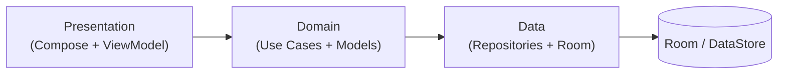

# 💸 Equify — Split group expenses and settle up instantly

[](https://play.google.com/store/apps/details?id=com.jarica.compartirgastos)
[](https://kotlinlang.org)
[](https://developer.android.com/jetpack/compose)
[](app/build.gradle.kts)
[](LICENSE)

🇪🇸 [Versión en español](README.md)

**Equify** is a native Android app for splitting group expenses: trips, shared flats, dinners or any plan with friends. Track who paid what and Equify instantly works out who owes whom, **keeping the number of transfers low**. No sign-up: open the app and start — your data stays on your device.

📲 **[Get it on Google Play](https://play.google.com/store/apps/details?id=com.jarica.compartirgastos)**

| Group summary | Settle up | About Equify |
|:---:|:---:|:---:|
|  |  |  |

---

## ✨ Features

- **Groups**: create groups and add participants in seconds, no accounts required.
- **Expenses**: record who paid each expense and who it is split between.
- **Payments between members**: log transfers to settle debts as you go.
- **"Settle up"**: a settlement algorithm that resolves the group's balances and proposes a small set of transfers to get everyone even.
- **Summary & PDF**: total spent, outstanding balance and PDF export to share with the group.
- **5 languages**: Spanish, English, French, Italian and Portuguese.
- **Optional ad-free**: one-time in-app purchase to remove ads (Play Billing).

## 🛠️ Tech stack

| Layer | Technology |
|---|---|
| Language | 100% Kotlin (coroutines + Flow) |
| UI | Jetpack Compose + Material 3, single-activity, Navigation Compose |
| Dependency injection | Hilt |
| Persistence | Room (offline-first, versioned schemas in `app/schemas`) + DataStore Preferences |
| Monetization | Google AdMob + Play Billing (`remove_ads` purchase) |
| Firebase | Crashlytics, Remote Config (force update) |
| Quality | Unit tests (JUnit), R8/ProGuard in release |

## 🏗️ Architecture

Clean Architecture organized **by feature**, with a strict `data` / `domain` / `presentation` split inside each one:

```
app/src/main/java/com/jarica/compartirgastos/
├── app/                  # Application class, global setup
├── core/                 # Code shared across features
│   ├── billing/          # Play Billing (remove ads)
│   ├── data/             # Room database, DataStore, mappers
│   ├── di/               # Hilt modules
│   ├── domain/           # Shared domain models
│   ├── forceUpdate/      # Forced update via Remote Config
│   ├── navigation/       # Type-safe Compose navigation
│   └── presentation/     # Theme and reusable composables
└── features/
    ├── groups/           # data / domain / presentation
    ├── groupDetail/
    ├── costs/
    ├── payments/
    ├── balances/         # Settlement algorithm ("settle up")
    ├── people/
    ├── appInfo/
    └── splash/
```



Every screen follows the **ViewModel → Use Cases → Repository** flow, exposing UI state as `StateFlow` and keeping business logic in pure, testable use cases.

## 🧠 Technical decisions

- **Money as cents (`Long`)**: all amounts are stored and computed in cents to eliminate floating-point rounding errors; formatting to decimal happens only in the presentation layer.
- **Settlement with few transfers**: the `DoTheCountsUseCase` computes each member's net balance and applies a greedy algorithm that matches the largest debtor with the largest creditor, settling the group in at most *n−1* payments (the exact minimum is NP-hard). Covered by unit tests.
- **Offline-first**: the app works fully offline; Room is the single source of truth.
- **Versioned Room schemas**: every schema version is exported to `app/schemas`, enabling real, testable migrations.
- **Remote force update**: Firebase Remote Config can enforce a minimum app version without shipping a new release.
- **No custom backend**: privacy by design — user data never leaves the device.

## 🚀 Building the project

1. Clone the repository and open it in Android Studio (JDK 11+).
2. Add your own `google-services.json` to `app/` (your own Firebase project).
3. Run:

```bash
./gradlew assembleDebug
```

Release builds require your own keystore configured in `local.properties` (`RELEASE_STORE_FILE`, `RELEASE_STORE_PASSWORD`, `RELEASE_KEY_ALIAS`, `RELEASE_KEY_PASSWORD`).

## 🗺️ Roadmap

- [ ] Cloud sync and **groups shared by code** (Firestore + anonymous auth, keeping the offline-first approach)
- [ ] Room migrations with automated tests
- [ ] CI with GitHub Actions (build + tests on every push)
- [ ] Broader domain test coverage
- [ ] Split by shares and by percentage

## 🔒 Privacy

Data is stored locally on the device. Privacy policy: [jaricagames.github.io/Equify](https://jaricagames.github.io/Equify/)

## 📜 License

This project is licensed under the [MIT License](LICENSE).

---

Developed by **Juan Antonio Rivero** ([@JaricaGames](https://github.com/JaricaGames))
