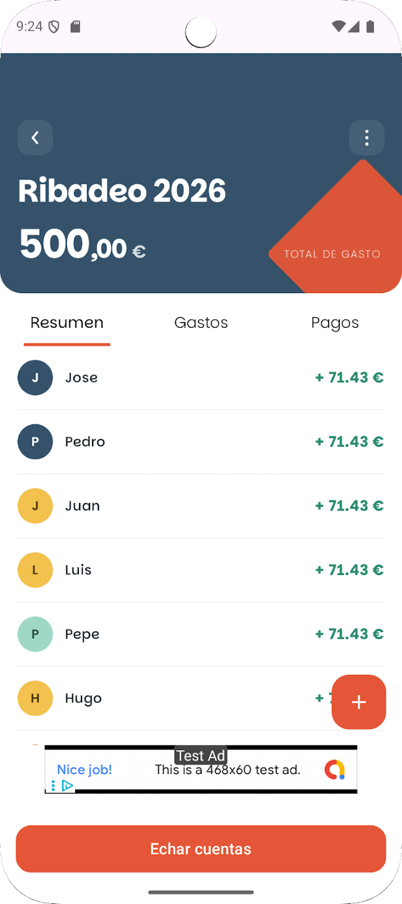
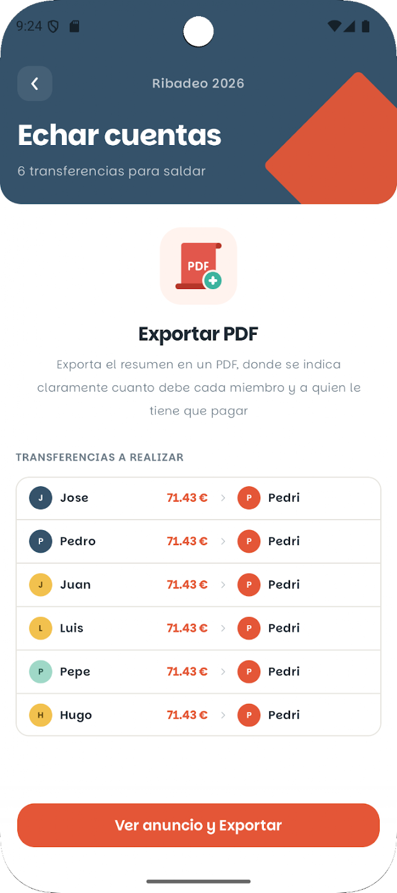
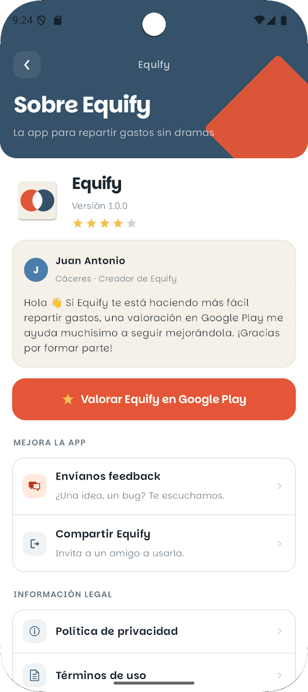
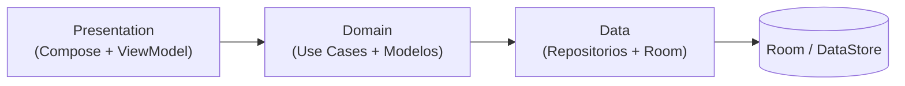

# 💸 Equify — Reparte gastos en grupo y liquida cuentas al instante

[](https://play.google.com/store/apps/details?id=com.jarica.compartirgastos)
[](https://kotlinlang.org)
[](https://developer.android.com/jetpack/compose)
[](app/build.gradle.kts)
[](LICENSE)

🇬🇧 [English version](README.en.md)

**Equify** es una app Android nativa para repartir gastos en grupo: viajes, pisos compartidos, cenas o cualquier plan con amigos. Apuntas quién paga qué y Equify calcula al instante quién debe a quién, **minimizando el número de transferencias**. Sin registro: abres la app y empiezas, tus datos se quedan en tu dispositivo.

📲 **[Descárgala en Google Play](https://play.google.com/store/apps/details?id=com.jarica.compartirgastos)**

| Resumen del grupo | Echar cuentas | Sobre Equify |
|:---:|:---:|:---:|
|  |  |  |

---

## ✨ Funcionalidades

- **Grupos**: crea grupos y añade participantes en segundos, sin cuentas ni registros.
- **Gastos**: registra quién pagó cada gasto y entre quiénes se reparte.
- **Pagos entre miembros**: anota transferencias para ir saldando deudas.
- **"Echar cuentas"**: algoritmo de liquidación que resuelve los saldos del grupo y propone el número mínimo de transferencias para quedar en paz.
- **Resumen y PDF**: total gastado, pendiente de liquidar y exportación en PDF para compartir con el grupo.
- **5 idiomas**: español, inglés, francés, italiano y portugués.
- **Sin anuncios opcional**: compra in-app única para eliminar la publicidad (Play Billing).

## 🛠️ Stack técnico

| Capa | Tecnología |
|---|---|
| Lenguaje | Kotlin 100% (corrutinas + Flow) |
| UI | Jetpack Compose + Material 3, single-activity, Navigation Compose |
| Inyección de dependencias | Hilt |
| Persistencia | Room (offline-first, esquemas versionados en `app/schemas`) + DataStore Preferences |
| Monetización | Google AdMob + Play Billing (compra `remove_ads`) |
| Firebase | Crashlytics, Remote Config (force update) |
| Calidad | Tests unitarios (JUnit), R8/ProGuard en release |

## 🏗️ Arquitectura

Clean Architecture organizada **por features**, con separación estricta `data` / `domain` / `presentation` en cada una:

```
app/src/main/java/com/jarica/compartirgastos/
├── app/                  # Application, configuración global
├── core/                 # Código compartido entre features
│   ├── billing/          # Play Billing (quitar anuncios)
│   ├── data/             # Base de datos Room, DataStore, mappers
│   ├── di/               # Módulos de Hilt
│   ├── domain/           # Modelos de dominio comunes
│   ├── forceUpdate/      # Actualización forzada vía Remote Config
│   ├── navigation/       # Navegación Compose type-safe
│   └── presentation/     # Tema y composables reutilizables
└── features/
    ├── groups/           # data / domain / presentation
    ├── groupDetail/
    ├── costs/
    ├── payments/
    ├── balances/         # Algoritmo de liquidación ("echar cuentas")
    ├── people/
    ├── appInfo/
    └── splash/
```



Cada pantalla sigue el flujo **ViewModel → Use Cases → Repositorio**, con el estado de UI expuesto como `StateFlow` y la lógica de negocio aislada en use cases puros y testeables.

## 🧠 Decisiones técnicas

- **Dinero en céntimos (`Long`)**: todos los importes se almacenan y operan en céntimos para eliminar errores de redondeo de coma flotante; solo se formatea a decimal en la capa de presentación.
- **Liquidación con pocas transferencias**: el use case `DoTheCountsUseCase` calcula los saldos netos y aplica un algoritmo greedy que empareja al mayor deudor con el mayor acreedor, saldando el grupo con como máximo *n−1* pagos (el mínimo exacto es NP-difícil). Está cubierto con tests unitarios.
- **Offline-first**: la app funciona 100% sin conexión; Room es la única fuente de verdad.
- **Esquemas de Room versionados**: cada versión del esquema se exporta a `app/schemas` para poder escribir y testear migraciones reales.
- **Force update remoto**: mediante Firebase Remote Config se puede exigir una versión mínima sin depender de despliegues.
- **Sin backend propio**: privacidad por diseño — los datos del usuario no salen del dispositivo.

## 🚀 Compilar el proyecto

1. Clona el repositorio y ábrelo con Android Studio (JDK 11+).
2. Añade tu `google-services.json` en `app/` (proyecto propio de Firebase).
3. Ejecuta:

```bash
./gradlew assembleDebug
```

Para compilar la release se necesita un keystore propio configurado en `local.properties` (`RELEASE_STORE_FILE`, `RELEASE_STORE_PASSWORD`, `RELEASE_KEY_ALIAS`, `RELEASE_KEY_PASSWORD`).

## 🗺️ Roadmap

- [ ] Sincronización en la nube y **grupos compartidos por código** (Firestore + auth anónima, manteniendo el enfoque offline-first)
- [ ] Migraciones de Room con tests automatizados
- [ ] CI con GitHub Actions (build + tests en cada push)
- [ ] Ampliar la batería de tests del dominio
- [ ] Reparto por partes y por porcentaje

## 🔒 Privacidad

Los datos se almacenan localmente en el dispositivo. Política de privacidad: [jaricagames.github.io/Equify](https://jaricagames.github.io/Equify/)

## 📜 Licencia

Este proyecto está bajo licencia [MIT](LICENSE).

---

Desarrollado por **Juan Antonio Rivero** ([@JaricaGames](https://github.com/JaricaGames))
